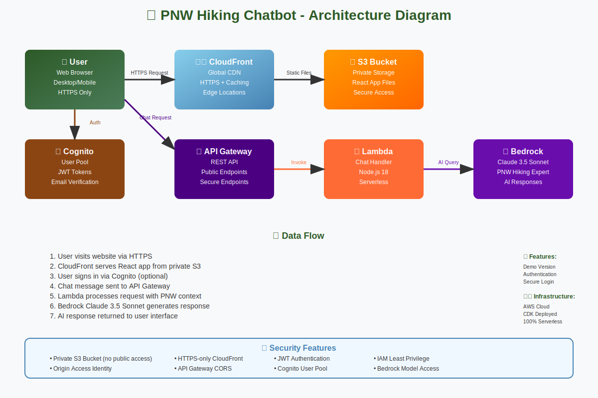

# 🌲 PNW Hiking Chatbot

An AI-powered hiking assistant for Pacific Northwest trails, built with AWS serverless architecture and powered by Claude 3.5 Sonnet.



## ✨ Features

- 🤖 **AI-Powered Assistance**: Claude 3.5 Sonnet with specialized PNW hiking knowledge
- 🔐 **Secure Authentication**: AWS Cognito user management with JWT tokens
- 🌐 **Global CDN**: CloudFront distribution with HTTPS and caching
- ⚡ **Serverless Architecture**: 100% serverless with automatic scaling
- 🏔️ **PNW Expertise**: Specialized knowledge of Washington and Oregon trails
- 📱 **Responsive Design**: Works perfectly on desktop and mobile
- 🔒 **Enterprise Security**: Private S3, IAM roles, and secure API endpoints

## 🚀 Live Demo

Try the chatbot with these sample questions:
- "What are the best hiking trails near Seattle?"
- "What gear do I need for rainy weather hiking?"
- "When is the best time to hike Mount Rainier?"
- "Tell me about hiking safety in bear country"

## 🏗️ Architecture

### Frontend
- **React TypeScript** application with modern UI
- **CloudFront** global CDN for fast content delivery
- **Private S3 Bucket** for secure static hosting
- **Responsive Design** optimized for all devices

### Backend
- **API Gateway** RESTful endpoints with CORS support
- **AWS Lambda** serverless chat processing (Node.js 18)
- **Amazon Bedrock** Claude 3.5 Sonnet integration
- **AWS Cognito** user authentication and management

### Security
- 🔒 Private S3 bucket with Origin Access Identity
- 🔐 JWT-based authentication via Cognito
- 🌐 HTTPS-only CloudFront distribution
- 🛡️ IAM least-privilege permissions
- 🚪 Protected API endpoints

## 🛠️ Technology Stack

| Component | Technology |
|-----------|------------|
| **Frontend** | React, TypeScript, HTML5, CSS3 |
| **Backend** | Node.js 18, AWS Lambda |
| **AI Model** | Claude 3.5 Sonnet (Bedrock) |
| **Authentication** | AWS Cognito User Pools |
| **API** | AWS API Gateway (REST) |
| **CDN** | AWS CloudFront |
| **Storage** | AWS S3 (Private) |
| **Infrastructure** | AWS CDK (TypeScript) |
| **Deployment** | Serverless, Auto-scaling |

## 📁 Project Structure

```
pnw-hiking-chatbot/
├── 📁 frontend/              # React TypeScript application
│   ├── 📁 src/
│   │   ├── 📁 components/    # React components
│   │   ├── App.tsx           # Main application
│   │   └── aws-config.ts     # AWS configuration
│   ├── 📁 build/             # Production build files
│   └── package.json
├── 📁 backend/               # Lambda function code
│   ├── 📁 lambda/
│   │   ├── chat-handler.js   # Main Lambda function
│   │   └── package.json
│   └── server.js             # Local development server
├── 📁 infrastructure/        # AWS CDK infrastructure
│   ├── 📁 lib/
│   │   └── pnw-hiking-chatbot-stack.ts
│   ├── 📁 bin/
│   └── package.json
├── 🎨 architecture-diagram.svg
├── 📚 README.md
└── 🚀 deploy-website.bat
```

## 🚀 Quick Start

### Prerequisites
- AWS CLI configured with appropriate permissions
- Node.js 18+ and npm
- AWS CDK installed globally: `npm install -g aws-cdk`

### Local Development
```bash
# Install all dependencies
npm run install-all

# Start local development servers
npm run dev
```

### Production Deployment
```bash
# Deploy to AWS (Windows)
deploy-website.bat

# Deploy to AWS (Linux/macOS)
./deploy-website.sh
```

## 🧪 Development Features

### Local Testing
- **Mock AI Responses**: Smart responses based on hiking keywords
- **No Authentication**: Skip auth for faster development
- **Hot Reload**: Automatic browser refresh on changes
- **CORS Enabled**: Frontend-backend communication

### Production Features
- **Real AI**: Claude 3.5 Sonnet via Amazon Bedrock
- **Full Authentication**: Cognito user management
- **Global CDN**: CloudFront edge locations worldwide
- **Auto-scaling**: Serverless architecture scales automatically

## 🎯 AI Capabilities

The chatbot provides expert advice on:

- **🥾 Trail Recommendations**: Popular PNW trails by difficulty and region
- **🎒 Gear Advice**: Essential equipment for Pacific Northwest conditions
- **🌦️ Weather Guidance**: Seasonal considerations and safety tips
- **🐻 Safety Information**: Wildlife awareness and emergency preparedness
- **📍 Local Knowledge**: Permits, parking, and trail conditions

## 🔧 Configuration

### Environment Variables
```bash
# AWS Configuration
AWS_REGION=us-west-2
AWS_ACCOUNT_ID=your-account-id

# Frontend Configuration
REACT_APP_AWS_REGION=us-west-2
REACT_APP_USER_POOL_ID=your-user-pool-id
REACT_APP_USER_POOL_CLIENT_ID=your-client-id
REACT_APP_API_URL=your-api-gateway-url
```

### AWS Services Required
- ✅ Amazon Bedrock (Claude 3.5 Sonnet access)
- ✅ AWS Lambda
- ✅ Amazon API Gateway
- ✅ AWS Cognito
- ✅ Amazon S3
- ✅ Amazon CloudFront
- ✅ AWS IAM

## 📊 Performance & Scalability

- **⚡ Fast Response Times**: CloudFront edge caching
- **🔄 Auto-scaling**: Lambda scales with demand
- **💰 Cost-effective**: Pay-per-use serverless model
- **🌍 Global Reach**: CloudFront edge locations worldwide
- **📈 High Availability**: Multi-AZ deployment

## 🛡️ Security Best Practices

- **Private S3 Bucket**: No public bucket policies
- **Origin Access Identity**: Secure CloudFront-S3 connection
- **JWT Authentication**: Secure API access tokens
- **HTTPS Everywhere**: All traffic encrypted in transit
- **IAM Least Privilege**: Minimal required permissions
- **Input Validation**: Secure API request handling

## 🤝 Contributing

1. Fork the repository
2. Create a feature branch: `git checkout -b feature/amazing-feature`
3. Commit changes: `git commit -m 'Add amazing feature'`
4. Push to branch: `git push origin feature/amazing-feature`
5. Open a Pull Request

## 📝 License

This project is licensed under the MIT License - see the [LICENSE](LICENSE) file for details.

## 🙏 Acknowledgments

- **AWS Bedrock** for providing Claude 3.5 Sonnet AI capabilities
- **Pacific Northwest hiking community** for inspiration
- **AWS CDK** for infrastructure as code
- **React community** for the amazing frontend framework

## 📞 Support

For questions, issues, or feature requests:
- 🐛 Open an issue on GitHub
- 💬 Start a discussion in the repository
- 📧 Contact the maintainers

---

**Built with ❤️ for Pacific Northwest hikers** 🏔️

*Explore safely, hike responsibly, and let AI be your guide to the beautiful trails of Washington and Oregon!*